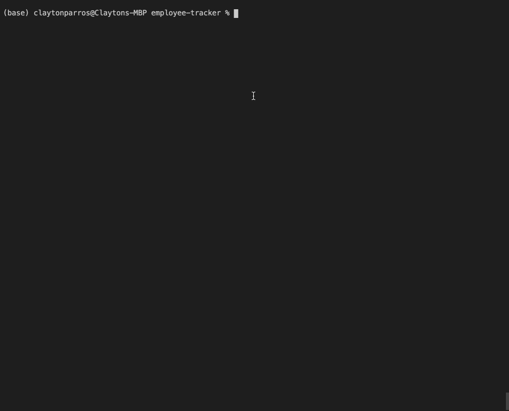

# employee-tracker

This a CLI application is designed to allow a team manager or ceo to update company department roles and employees. 

Future updates will include budget funcinality, as well as updating and viewing managers.

It is a part of UNC Coding Bootcamp and is practice in writing and using mysql.

[Instructional Video](https://drive.google.com/file/d/1YuO77Px5q7F109UyHtKCR1-57nqNY8kQ/view)

## Installation

Use: npm i inquirer, 
Use: npm i mysql

## Starting Application
Start: npm Start

## Questions
Celparros@gmail.com
